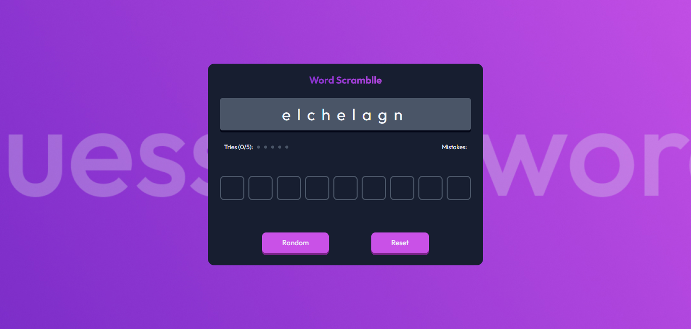

<!-- Please update value in the {}  -->

<h1 align="center">Guess The Word Game | devChallenges</h1>

<div align="center">
   Solution for a challenge <a href="https://devchallenges.io/challenge/guess-the-word" target="_blank">Guess The Word Game
</a> from <a href="http://devchallenges.io" target="_blank">devChallenges.io</a>.
</div>

<div align="center">
  <h3>
    <a href="https://gustavo2023.github.io/guess-the-word-game/">
      Demo
    </a>
    <span> | </span>
    <a href="https://devchallenges.io/solution/46830">
      Solution
    </a>
    <span> | </span>
    <a href="https://devchallenges.io/challenge/guess-the-word">
      Challenge
    </a>
  </h3>
</div>

<!-- TABLE OF CONTENTS -->

## Table of Contents

- [Overview](#overview)
  - [What I learned](#what-i-learned)
- [Built with](#built-with)
- [Features](#features)

<!-- OVERVIEW -->

## Overview



This Guess the Word Game challenges the user to guess each letter of a random scrambled word. The user can generate a new random word or reset the game whenever they want.

### What I learned

- Learned about the Fisher-Yates (Knuth) algorithm which is useful to scramble any word randomly by providing a more uniform distribution of permutations.
- Used JavaScript to generate HTML elements with the properties and attributes that I require. This way I can take advantage of certain attributes in order to use them to create a desired effect or anything of the sort. For example I gave each letter input a ```data-index``` and then used it to compare to the letter the user entered in the corresponding input.

### Built with

- Semantic HTML5 markup
- CSS custom properties
- Flexbox
- JavaScript

## Features

- **Random word generation**
- **Scramble word**
- **Input validation**
- **Game over verification**

This application/site was created as a submission to a [DevChallenges](https://devchallenges.io/challenges-dashboard) challenge.

## Author

- GitHub [@gustavo2023](https://github.com/gustavo2023)
